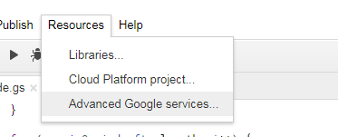
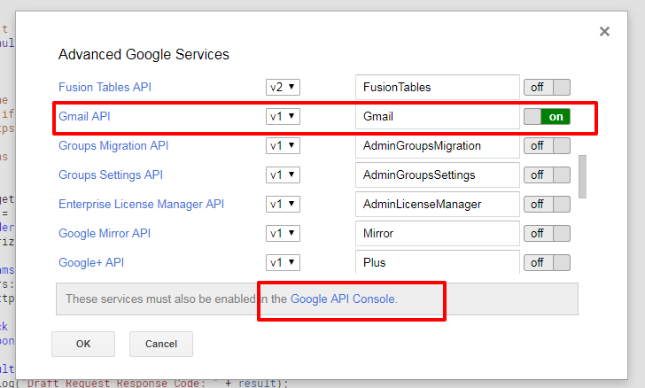
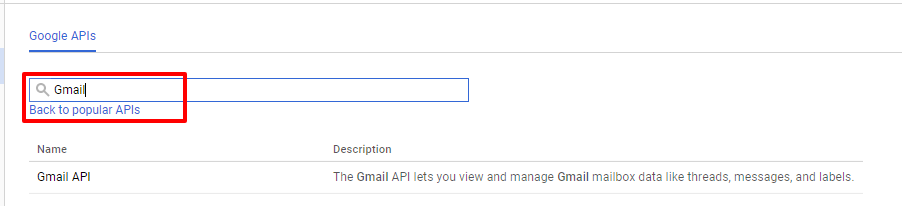
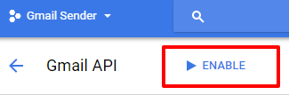

# Easy Gmail Scheduler

Responsive Gmail scheduler built with [Bootstrap 3](https://getbootstrap.com/) and running on [Google Apps Scripts](https://www.google.com/script/start/).

Developed and designed by [Raybb](https://github.com/RayBB).

## Demo
Check it out:
* [live](https://raybb.github.io/easy-gmail-scheduler/src/frontend/) (dummy data, no authorization)
* Unfortunately, Google has removed the ability for my demo to send you emails so you must follow setup instrucitons below to use it now.

## Features
* Schedule unlimited emails
* Automatically loads drafts
* Email sent in case of error
* No 3rd party servers
* Responsive and mobile friendly layout
* Lightweight (only 160KB)

### Future Features
* Welcome email
* Add favicon
* Offline mode
* Render with React and JSX
    * Visual warning if scheduled email isn't found in drafts

### Known Issues
* When embedded in an iframe page must first start at 101% height and then be shrunken to allow scrolling.

### Limitations
* Regular Gmail accounts are limited to 500 emails per day. [More info](https://support.google.com/mail/answer/22839?hl=en)
* Please see [Usage Limits](https://developers.google.com/gmail/api/v1/reference/quota) for more information.

## Installation
1. Visit Google Drive
2. Click New > More > Google Apps Script
    * Copy backend/gmail.js to the main code.gs file
3. Click File > New > Html file
    * Name it index.html and copy frontend/index.html into it
4. Authenticate Script
    * Instructions [here](https://github.com/RayBB/easy-gmail-scheduler#authorization). Only the owner is required to do this.
5. Click Publish > Deploy as web app
    * Execute the app as: "User accessing the web app"
    * Who has acces to the app: "Anyone"
    * Click Deploy
    * Copy link and enjoy! :)

## Inspiration
For years I've wanted to be able to send emails later for various reasons. Sometimes to get at the top of their inbox when they'll be in the office. Sometimes to just make sure an email is sent in the morning but gives me times to think on it but not worry about sending it.

The main solutions I found at the time, in 2016, were Right Inbox and Boomerang. Both had free tiers to send a few emails but required giving a third-party access to your email.

I stumbled upon Google Apps Scripts and realized their APIs could do just what I needed. It didn't take long until I bumped into the Gmail scheduler by [labnol.org](https://www.labnol.org/internet/schedule-gmail-send-later/24867/). I now knew it was possible but really didn't like the idea of having to open a spreadsheet to schedule the emails. I knew it was possible to make a simpler version of their script with a nice web interface so that's what I did. Big thanks to labnol.org for their original work. I did end up using their function for sending drafts since it was already well made.

## Authorization

In order to send drafts that are part of threads, we utilize the GMail API. To use this, you must enable that API both in the Scripts project and in the Google Cloud Console.

First, enable the Gmail API in the scripts project:
 

  

Next, Enable the Gmail API in the Google Cloud Console. Click the link at the bottom of the window in the Advanced Google Services. In the search box, type GMail and click on the Gmail API below it.

Click enable to turn on the Gmail Services.

## Dependencies
* [Bootstrap 3](https://getbootstrap.com/)
* [Moment.js](https://momentjs.com/)
* [Pikaday](https://github.com/dbushell/Pikaday) (for browsers without date support)

## How can I support developers?
- Star our GitHub repo :star:
- Create pull requests, submit bugs, suggest new features or documentation updates :wrench:

## License
[MIT](https://github.com/RayBB/easy-gmail-scheduler/blob/master/LICENSE) license.
